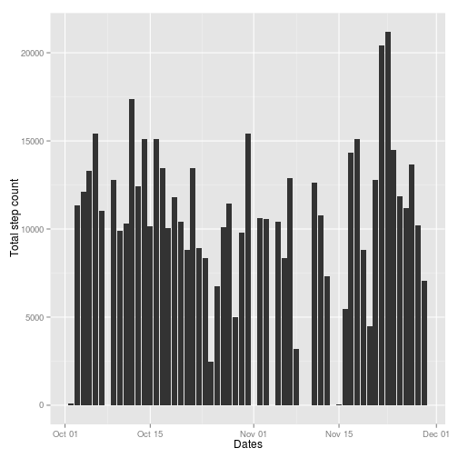
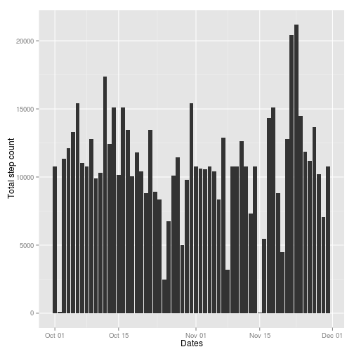
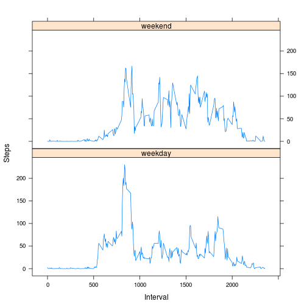

# Reproducible Research: Peer Assessment 1

## Load and preprocess the data

Loading activities from ZIP file stored with project.


```r
act <- read.csv(unz("activity.zip", "activity.csv"))
```

## What is mean total number of steps taken per day?

Creating a histogram using complete cases from dataset. The histogram will
chart the total number of steps taken each day.

Reporting the mean and median values for the step totals of each day.


```r
# Create data table and filter out incomplete cases
library(data.table)
# Creating data.table to aid in aggregate calculation
dt <- data.table(act[complete.cases(act),])

# Get aggregate sum for steps by day
aggAct <- dt[,list(steps=sum(steps)), by=date]
# Translate factors to dates for charting purposes
aggAct$date <- as.Date(aggAct$date)

# Make a histogram of the total number of steps taken each day
library(ggplot2)
```

```
## 
## Attaching package: 'ggplot2'
## 
## The following object is masked from 'mtcars':
## 
##     mpg
```

```r
qplot(date, steps, data=aggAct, xlab="Dates", ylab="Total step count", geom="histogram", stat="identity") 
```

 

```r
# Calculate and report the mean and median total number of steps taken per day.
# Interpreting this as asking for the mean and median of the daily step total values.
mean(aggAct$steps)
```

```
## [1] 10766
```

```r
median(aggAct$steps)
```

```
## [1] 10765
```

## What is the average daily activity pattern?

Creating a time series plot that captures the average number of steps taken for each interval across
all of the days represented in the dataset.

Reporting the 5-minute interval with the largest average number of steps across the dataset.


```r
# Aggreagate by interval
aggAct <- dt[,list(steps=mean(steps)), by=interval]

# Make a time series plot (i.e. type = "l") of the 5-minute interval (x-axis) and the average number of steps taken,
# averaged across all days (y-axis)
plot(aggAct$interval, aggAct$steps, type="l", xlab="Interval", ylab="Average number of steps") 
```

 

```r
# Which 5-minute interval, on average across all the days in the dataset, contains the maximum number of steps?
aggAct[with(aggAct, order(-steps)), interval][1]
```

```
## [1] 835
```

## Imputing missing values

Imputing values for intervals in the dataset with missing values (coded as NA). The imputed values are calculated
by taking the average for the interval in question across all days in the dataset with complete cases.

Creating a historam of the daily total number of steps for each day. 

Calculating the mean and the median total number of steps taken each day using the daily step total. The methodology
selected for imputing the data results in very little change for these values.


```r
# Calculate and report the total number of missing values in the dataset (i.e. the total number of rows 
# with NAs)
length(which(is.na(act$steps)))
```

```
## [1] 2304
```

```r
# Create a new dataset that is equal to the original dataset but with the missing data filled in.
# Substituting rounded mean value for steps using mean for interval period
act$steps[is.na(act$steps)] <- ave(act$steps, 
                                   act$interval, 
                                   FUN=function(x) round(mean(x, na.rm=TRUE)))[c(which(is.na(act$steps)))]

# How many incomplete observations are there now?
length(which(is.na(act$steps)))
```

```
## [1] 0
```

```r
# Creating data.table to aid in aggregate calculation
dt <- data.table(act)

# Get aggregate sum for steps by day
aggAct <- dt[,list(steps=sum(steps)), by=date]
# Translate factors to dates for charting purposes
aggAct$date <- as.Date(aggAct$date)

qplot(date, steps, data=aggAct, xlab="Dates", ylab="Total step count", geom="histogram", stat="identity") 
```

 

```r
# Was 10766 without imputing
mean(aggAct$steps)
```

```
## [1] 10766
```

```r
# Was 10765 without imputing
median(aggAct$steps)
```

```
## [1] 10762
```

## Are there differences in activity patterns between weekdays and weekends?

Classifying the observations by whether they fall in the weekend or weekday.

Creating a panel plot that displays the observations broken out according to their classification as a weekend or weekday. As above,
we capture each 5-minute interval and display a value for the average value for each interval.


```r
# Create a new factor variable in the dataset with two levels – “weekday” and “weekend” indicating whether a given date
# is a weekday or weekend day.
dt <- data.table(act[complete.cases(act),])
dt$date <- as.Date(dt$date)
dt$date.type <- ifelse(is.element(weekdays(dt$date), c("Saturday","Sunday")), "weekend", "weekday")
dt$date.type <- as.factor(dt$date.type)

# Aggregate by interval and date.type (weekend or weekday)
aggAct <- dt[,list(steps=mean(steps)), by = list(interval, date.type)]

# Make a panel plot containing a time series plot (i.e. type = "l") of the 5-minute interval (x-axis) and the average
# number of steps taken, averaged across all weekday days or weekend days (y-axis).
library(lattice)
xyplot(steps ~ interval | date.type, data = aggAct,
   xlab="Interval", ylab="Steps", type="l", layout=c(1, 2))
```

 
